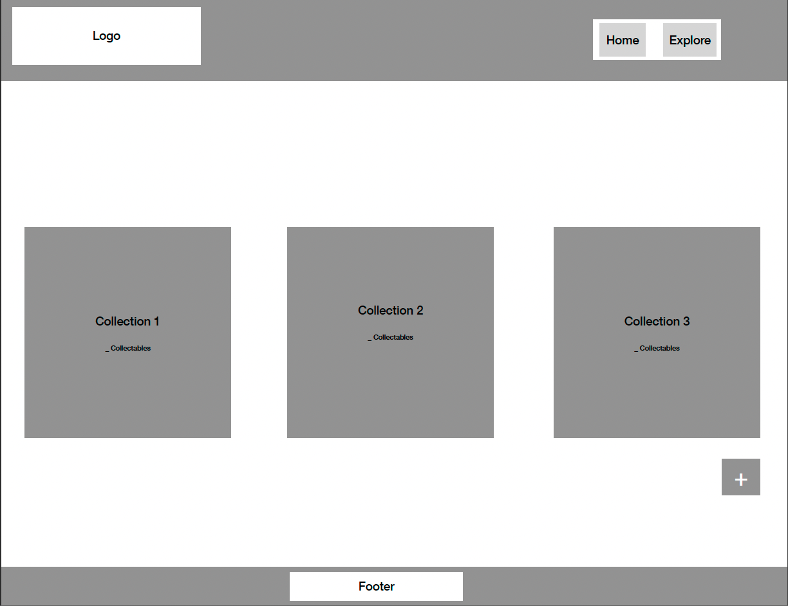
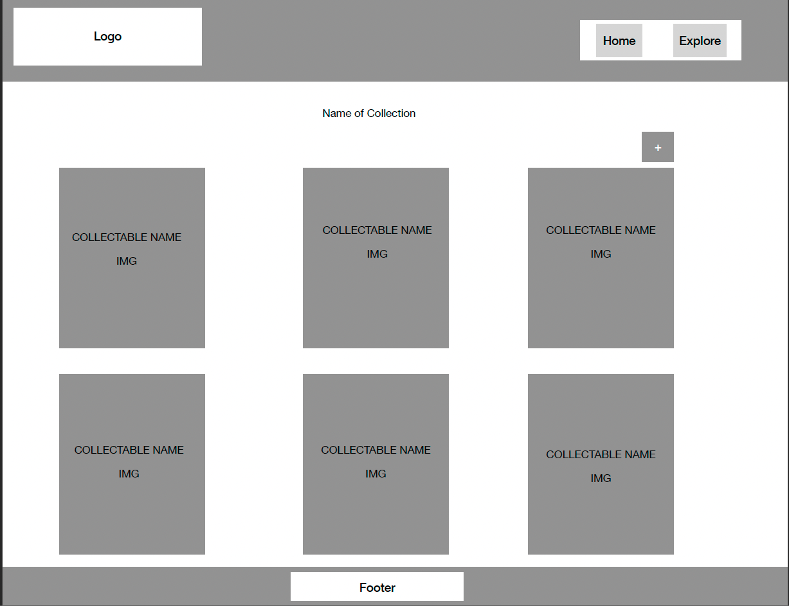

# Collectus Front-End

This is the repo for the front-end of the Collectus app. The purpose of this app is to allow users to inventory and share their collectibles.

### Collectus Back-End

The other half of this app can be found at:

> https://github.com/Team-This-Is-Fine/collectus-api

### Application Link

> https://animated-pony-a34044.netlify.app/

## Technologies Used

* JavaScript
* React
* React-router-dom
* Bootstrap
* React-bootstrap
* HTML
* CSS
* Axios

## Installation Instructions

* fork and clone this repo
* cd in the repo
* open in your IDE
* in terminal:

```
npm i
npm i react react-router-dom bootstrap react-boostrap axios
npm start
```

Open http://localhost:3000 to view it in your browser.

### IMPORTANT NOTE

In order to use this code, you will also need to install:

> https://github.com/Team-This-Is-Fine/collectus-api

## App Screenshots


## Contribution Guidelines

### How to Contribute

Feel free to contribute to this app with code or suggestions. If you would like to contribute code - install the app, checkout to a dev branch, play with the code, then submit a pull request.

### How to Identify Bugs

You can submit an issue on the git repo, or work on a dev branch and submit a pull request with suggested code to fix the bug. Please detail the bug and recommendations for solutions if possible.

### How to Propose Improvements

You can submit an issue on the git repository detailing your suggestion.

# Planning

## Wireframes





## User Stories

### MVP Goals

* As a user, I would like to make a new collection and be able to add collectibles to it so that I can categorize my collectibles to better organize them.
* As a user, I would like to view, edit, and delete a collection so that I can maintain an accurate and organized system for my collectibles.
* As a user, I would like to view and delete items so that I can organize my collectible items individually.

### Stretch Goals

* As a user, I would like to see a better design so that my collections can appear as valuable as they are to me.
* As a user, I would like to be able to edit my collectibles so that I can maintain the accuracy of my collections.
* As a user, I would like to have user authentication and authorization so that my collections/collectibles aren't accessible to everyone.
* As a user, I would like to be able to see other users collections/collectibles so that I can find like-minded collectors.

## Approach Taken

For the development of this app, we had a group of four and about 3.5 days to finish. We wanted to try a few different approaches that would allow us to work efficiently while still challenging us to be better developers. To include:

* Pair programming - for the first half of the project, we split into pairs - one focusing on front-end, the other focusing on back-end.

* Mob programming - when faced with difficult bugs or problems, we would consolidate into one group to solve the problem. This was the primary approach during the second half of the project timeeline.

* Tokens - we set rules for using tokens in order to mitigate excessive usage. If you can't solve something by yourself after about 15 min, get a partner to solve it. If two people can't solve it after 15 min, we all consolidate and try to figure it out with all four members. If it still is too difficult, we would use a token to get help.

* Work hours - there was never anything established for coding outside of class time (0900-1700).